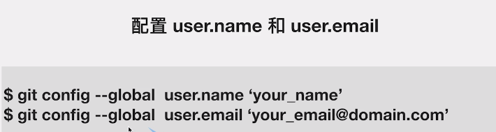
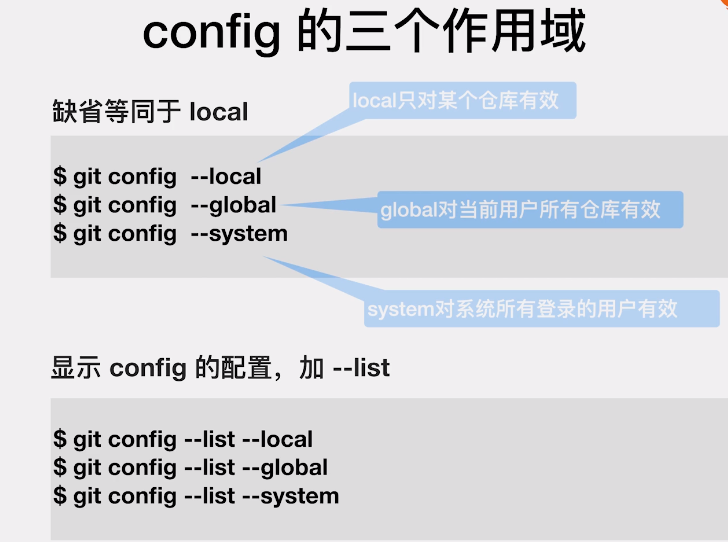
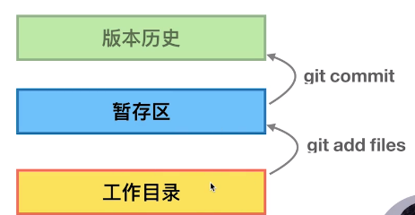
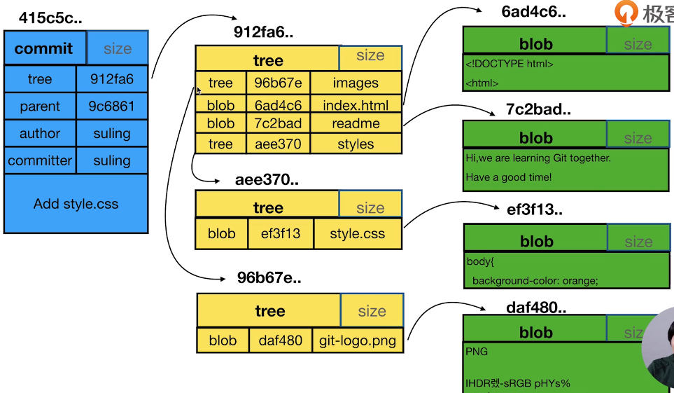

# git 配置

pwd 显示当前目录
ls 显示当前目录下的文件
ls -al 显示文件详细信息



# 获取帮助

详细帮助

- git help <verb>
- git <verb> --help
- man git-<verb>

简略帮助

- git <verb> -h

# 第一个仓库

## 初始化

初始化后会建立一个.git 的隐藏文件夹

- git init 在已有的项目中初始化
- git init yourproject 初始化一个新的 git 项目

## 添加文件到暂存区

git add readme.txt 添加指定文件 多个文件或文件夹用空格分隔
git add -u 添加所有已被跟踪的文件到暂存区

## 查看状态

git status

## 提交 将暂存区的文件提交到仓库

git commit -m 'add readme.txt'

# 查看日志

git log

# git 区域



# 重命名文件

1. 在工作区重命名
1. mv readme.md readme.txt
1. git rm readme.md
1. git add readme.txt
1. git commit -m 'rename readme'

1. 使用 git 重命名
1. git mv readme.md readme.txt
1. git commit -m 'rename readme'

> git reset --hard 重置暂存区与工作目录

# 查看历史版本

- git log
- git log --oneline
- git log -n4
- git log --all
- git log --graph

- git branch -av 查看本地的分支
- git branch branchname 创建分支
- git checkout branchname 切换分支
- git check -b branchname 创建并切换分支

#图形界面工具
gitk 打开图形界面工具
gitk --all 打开所有分支

# 探秘.git 目录

- HEAD ： 记录当前是在哪个分支上
- config ： 记录当前仓库的配置信息
- refs ：里面有 heads(分支) 和 tag 两个文件夹
- objects ： 存放文件内容
- cat filename ： 可以产看文件内容
- git cat-file-t 哈希值 ：查看对象类型
- git cat-file-p 哈希值 ：查看文件内容

# commit tree blob

- commit :每次提交就产生一个 commit 对象
- tree：表示目录
- blob：表示文件

每次提交都记录了当时的一个快照


# 分支

- git branch -av 查看所有分支
- git branch 查看当前分支
- git branch -d branchName 删除分支
- git branch -D branchName 删除分支（强制删除）

# 修改提交信息

## 修改最近一次提交

git commit --amend

# 比较

默认比较全部文件的差异 命令后可以加 -- fielname 单独比较这一个文件的差异 可以添加多个文件 用空格隔开

## 比较暂存区与最近一次提交的差异

git diff --cached

## 比较工作区与暂存区的差异

git diff

## 比较不同提交之间的差异

- git diff master temp --[filename] 比较 master 分支与 temp 分支最近一次提交的差异
- git diff 343522 24522 --[filename] 比较 343522commit 与 24522commit 的差异

# 恢复

## 将暂存区恢复成最近一次提交

git reset HEAD --[filename]

## 将工作区恢复成和暂存区一样

git checkout --[filename]

## 将暂存区和工作区恢复成最近一次提交

git reset --hard

## 删除最近几次的提交，并且将暂存区和工作区恢复成这次提交

git reset --head 545643

# 删除文件

## 方式 1

1. rm readme.txt
2. git rm readme.txt

## 方式 2

1. git rm readme.txt

# stash 存储临时任务

- git stash 将工作区的变更临时存储
- git stash list 查看临时存储列表
- git stash apply 申请最近一次临时存储 不从列表中移除
- git stash pop 申请最近一次临时存储，并且将其从列表中删除

# git 常用命令。

## 创建 SSH Key

```shell
$ ssh-keygen -t rsa -C "youremail@example.com"
```

## 配置用户信息

```shell
$ git config --global user.name "Your Name"
$ git config --global user.email "email@example.com"
```

## 仓库

> 在当前目录新建一个 Git 代码库

```shell
$ git init
```

> 新建一个目录，将其初始化为 Git 代码库

```shell
$ git init [project-name]
```

> 下载一个项目和它的整个代码历史

```shell
$ git clone [url]
```

## 增加/删除文件

> 添加指定文件到暂存区

```shell
$ git add [file1] [file2] ...
```

> 添加指定目录到暂存区，包括子目录

```shell
$ git add [dir]
```

> 添加当前目录的所有文件到暂存区

```shell
$ git add .
```

> 添加每个变化前，都会要求确认
> 对于同一个文件的多处变化，可以实现分次提交

```shell
$ git add -p
```

> 删除工作区文件，并且将这次删除放入暂存区

```shell
$ git rm [file1] [file2] ...
```

> 停止追踪指定文件，但该文件会保留在工作区

```shell
$ git rm --cached [file]
```

> 改名文件，并且将这个改名放入暂存区

```shell
$ git mv [file-original] [file-renamed]
```

## 代码提交

> 提交暂存区到仓库区

```shell
$ git commit -m [message]
```

> 提交工作区自上次 commit 之后的变化，直接到仓库区

```shell
$ git commit -a
```

> 提交时显示所有 diff 信息

```shell
$ git commit -v
```

> 使用一次新的 commit，替代上一次提交
> 如果代码没有任何新变化，则用来改写上一次 commit 的提交信息

```shell
$ git commit --amend -m [message]
```

> 重做上一次 commit，并包括指定文件的新变化

```shell
$ git commit --amend [file1] [file2] ...
```

## 查看信息

> 显示有变更的文件

```shell
$ git status
```

> 显示当前分支的版本历史

```shell
$ git log
```

> 显示 commit 历史，以及每次 commit 发生变更的文件

```shell
$ git log --stat
```

> 搜索提交历史，根据关键词

```shell
$ git log -S [keyword]
```

> 显示某个 commit 之后的所有变动，每个 commit 占据一行

```shell
$ git log [tag] HEAD --pretty=format:%s
```

> 显示某个 commit 之后的所有变动，其"提交说明"必须符合搜索条件

```shell
$ git log [tag] HEAD --grep feature
```

> 显示某个文件的版本历史，包括文件改名

```shell
$ git log --follow [file]
```

> 显示指定文件相关的每一次 diff

```shell
$ git log -p [file]
```

> 显示过去 5 次提交

```shell
$ git log -5 --pretty --oneline
```

> 显示所有提交过的用户，按提交次数排序

```shell
$ git shortlog -sn
```

> 显示指定文件是什么人在什么时间修改过

```shell
$ git blame [file]
```

> 显示暂存区和工作区的差异

```shell
$ git diff
```

> 显示暂存区和上一个 commit 的差异

```shell
$ git diff --cached [file]
```

> 显示工作区与当前分支最新 commit 之间的差异

```shell
$ git diff HEAD
```

> 显示两次提交之间的差异

```shell
$ git diff [first-branch]...[second-branch]
```

> 显示今天你写了多少行代码

```shell
$ git diff --shortstat "@{0 day ago}"
```

> 显示某次提交的元数据和内容变化

```shell
$ git show [commit]
```

> 显示某次提交发生变化的文件

```shell
$ git show --name-only [commit]
```

> 显示某次提交时，某个文件的内容

```shell
$ git show [commit]:[filename]
```

> 显示当前分支的最近几次提交

```shell
$ git reflog
```

## 分支

> 列出所有本地分支

```shell
$ git branch
```

> 列出所有远程分支

```shell
$ git branch -r
```

> 列出所有本地分支和远程分支

```shell
$ git branch -a
```

> 新建一个分支，但依然停留在当前分支

```shell
$ git branch [branch-name]
```

> 新建一个分支，并切换到该分支

```shell
$ git checkout -b [branch]
```

> 新建一个分支，指向指定 commit

```shell
$ git branch [branch] [commit]
```

> 新建一个分支，与指定的远程分支建立追踪关系

```shell
$ git branch --track [branch] [remote-branch]
```

> 切换到指定分支，并更新工作区

```shell
$ git checkout [branch-name]
```

> 切换到上一个分支

```shell
$ git checkout -
```

> 建立追踪关系，在现有分支与指定的远程分支之间

```shell
$ git branch --set-upstream [branch] [remote-branch]
```

> 合并指定分支到当前分支

```shell
$ git merge [branch]
```

> 选择一个 commit，合并进当前分支

```shell
$ git cherry-pick [commit]
```

> 删除分支

```shell
$ git branch -d [branch-name]
```

> 删除远程分支

```shell
$ git push origin --delete [branch-name]
```

## 标签

> 列出所有 tag

```shell
$ git tag
```

> 新建一个 tag 在当前 commit

```shell
$ git tag [tag]
```

> 新建一个 tag 在指定 commit

```shell
$ git tag [tag] [commit]
```

> 删除本地 tag

```shell
$ git tag -d [tag]
```

> 删除远程 tag

```shell
$ git push origin :refs/tags/[tagName]
```

> 查看 tag 信息

```shell
$ git show [tag]
```

> 提交指定 tag

```shell
$ git push [remote] [tag]
```

> 提交所有 tag

```shell
$ git push [remote] --tags
```

> 新建一个分支，指向某个 tag

```shell
$ git checkout -b [branch] [tag]
```

## 远程同步

> 下载远程仓库的所有变动

```shell
$ git fetch [remote]
```

> 显示所有远程仓库

```shell
$ git remote -v
```

> 显示某个远程仓库的信息

```shell
$ git remote show [remote]
```

> 增加一个新的远程仓库，并命名

```shell
$ git remote add [shortname] [url]
```

> 取回远程仓库的变化，并与本地分支合并

```shell
$ git pull [remote] [branch]
```

> 允许不相关历史提交,并强制合并

```shell
$ git pull origin master --allow-unrelated-histories
```

> 上传本地指定分支到远程仓库

```shell
$ git push [remote] [branch]
```

> 强行推送当前分支到远程仓库，即使有冲突

```shell
$ git push [remote] --force
```

> 推送所有分支到远程仓库

```shell
$ git push [remote] --all
```

## 撤销

> 恢复暂存区的指定文件到工作区

```shell
$ git checkout [file]
```

> 恢复某个 commit 的指定文件到暂存区和工作区

```shell
$ git checkout [commit] [file]
```

> 恢复暂存区的所有文件到工作区

```shell
$ git checkout .
```

> 重置暂存区的指定文件，与上一次 commit 保持一致，但工作区不变

```shell
$ git reset [file]
```

> 重置暂存区与工作区，与上一次 commit 保持一致

```shell
$ git reset --hard
```

> 重置当前分支的指针为指定 commit，同时重置暂存区，但工作区不变

```shell
$ git reset [commit]
```

> 重置当前分支的 HEAD 为指定 commit，同时重置暂存区和工作区，与指定 commit 一致

```shell
$ git reset --hard [commit]
```

> 重置当前 HEAD 为指定 commit，但保持暂存区和工作区不变

```shell
$ git reset --keep [commit]
```

> 新建一个 commit，用来撤销指定 commit
> 后者的所有变化都将被前者抵消，并且应用到当前分支

```shell
$ git revert [commit]
```

> 暂时将未提交的变化移除，稍后再移入

```shell
$ git stash
$ git stash pop
```

## 忽略文件配置（.gitignore)

1、配置语法:

> 以斜杠“/”开头表示目录；
>
> 以星号“\*”通配多个字符；
>
> 以问号“?”通配单个字符
>
> 以方括号“[]”包含单个字符的匹配列表；
>
> 以叹号“!”表示不忽略(跟踪)匹配到的文件或目录；

此外，git 对于 .ignore 配置文件是按行从上到下进行规则匹配的，意味着如果前面的规则匹配的范围更大，则后面的规则将不会生效；

2、示例：

（1）规则：fd1/\*
　　　　 说明：忽略目录 fd1 下的全部内容；注意，不管是根目录下的 /fd1/ 目录，还是某个子目录 /child/fd1/ 目录，都会被忽略；

（2）规则：/fd1/\*
　　　　 说明：忽略根目录下的 /fd1/ 目录的全部内容；

（3）规则：

/\*
!.gitignore
!/fw/bin/
!/fw/sf/

说明：忽略全部内容，但是不忽略 .gitignore 文件、根目录下的 /fw/bin/ 和 /fw/sf/ 目录；
